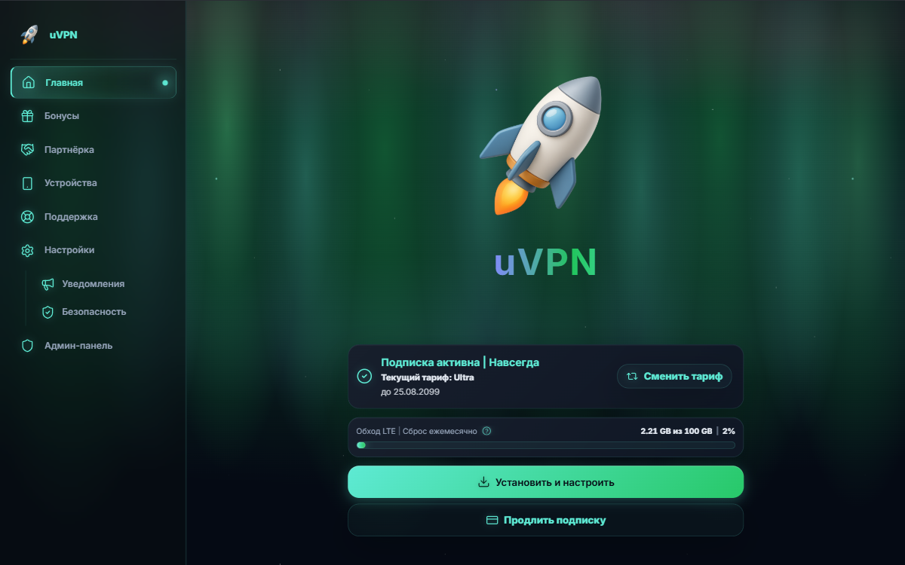

# 🌊 Aurora — Полярное сияние

Спокойная, гипнотическая тема в духе ночного неба над Исландией. Волны полярного сияния медленно текут по горизонту, вертикальные aurora-лучи подсвечивают небо, звёзды мерцают, падающие звёзды прочерчивают диагонали, а панели выполнены в стиле матового стекла.

## 📸 Превью



## ✨ Особенности

### Фон

- **Волна полярного сияния** — слой с многоцветным градиентом (индиго → бирюза → зелёный → бирюза), форма задаётся через `mask-image` из шести смещённых радиальных «горбов». Дрейфует по горизонтали 180s на цикл.
- **Вертикальные aurora-лучи** — семь высоких эллипсов-градиентов разной высоты и цвета. Дают ощущение настоящих «занавесов» северного сияния.
- **Звёздное небо** — девять звёзд разного размера и яркости, одна «полярная» с бирюзовым свечением. Лёгкое мерцание 9s.
- **Две падающие звезды** — диагональные треки со свечением в бирюзе и индиго. Летят раз в 50s и 65s, не синхронно.

### UI

- **Логотип** — переливающийся градиент бирюза → зелёный → индиго с анимацией `background-position` (12s).
- **Aurora-край сайдбара** — вертикальная градиентная линия по правому краю.
- **Активные пункты меню** — левая полоса + пульсирующая бирюзовая точка + внутреннее свечение.
- **Кнопки** — aurora-градиент + пробегающий блик через `::before`.
- **Прогресс-бары** — многослойный градиент (бирюза → зелёный → индиго) + сканирующий блеск.
- **Фокус форм** — aurora-кольцо с внешним свечением.
- **Карточки** — матовое стекло; при наведении появляется aurora-обводка и мягкое свечение.
- **Иконки Lucide** — бирюзовое свечение через `drop-shadow`.
- **Скроллбар** — aurora-градиент на ползунке.

### Доступность и мобильные

- Все анимации отключаются при `prefers-reduced-motion: reduce`.
- На `≤ 1023px` волна замедляется, звёзды тускнеют, падающие звёзды и пульсации выключаются, blur снижается.

## 🎨 Токены

### Основные цвета

| Токен        | Значение     | Плашка                                                                                    | Использование                                                                 |
| ----------------- | -------------------- | ----------------------------------------------------------------------------------------------- | ------------------------------------------------------------------------------------------ |
| `accent`        | `#5eead4`          | #5eead4#5eead4" />       | Главный акцент, ссылки, активные элементы, кнопки |
| `bg`            | `#050a14`          | #050a14#050a14" />       | Ночной фон                                                                        |
| `panel`         | `#0a1220`          | #0a1220#0a1220" />       | Основные панели                                                              |
| `panel_2`       | `#0e1624`          | #0e1624#0e1624" />       | Вторичные поверхности                                                  |
| `panel_3`       | `#080e18`          | #080e18#080e18" />       | Сайдбар, dropdown                                                                   |
| `blue`          | `#818cf8`          | #818cf8#818cf8" />       | Индиго для градиентов и info-состояний                        |
| `border`        | `#5eead4` (α .12) | #5eead41F#5eead41F" /> | Обычные границы                                                              |
| `border_strong` | `#5eead4` (α .25) | #5eead440#5eead440" /> | Активные границы                                                            |

### Текст и состояния

| Токен | Значение | Плашка                                                                              | Использование              |
| ---------- | ---------------- | ----------------------------------------------------------------------------------------- | --------------------------------------- |
| `text`   | `#e2e8f0`      | #e2e8f0#e2e8f0" /> | Основной текст             |
| `muted`  | `#94a3b8`      | #94a3b8#94a3b8" /> | Второстепенный текст |
| `dim`    | `#64748b`      | #64748b#64748b" /> | Placeholder, подписи             |
| `danger` | `#f87171`      | #f87171#f87171" /> | Ошибки                            |

## 🎨 Палитра

| Цвет                            | HEX         | Плашка                                                                              | Где встречается                                                                        |
| ----------------------------------- | ----------- | ----------------------------------------------------------------------------------------- | ---------------------------------------------------------------------------------------------------- |
| Бирюза (accent)               | `#5eead4` | #5eead4#5eead4" /> | Акцент везде: волны, логотип, кнопки, активные элементы |
| Светлая бирюза         | `#7df1dc` | #7df1dc#7df1dc" /> | Hover ссылок                                                                                   |
| Зелёный                      | `#22c55e` | #22c55e#22c55e" /> | Середина градиентов, средняя часть волны                          |
| Индиго                        | `#818cf8` | #818cf8#818cf8" /> | Верхняя часть волны, конец градиента                                  |
| Фиолет                        | `#a78bfa` | #a78bfa#a78bfa" /> | Зарезервирован для расширения                                             |
| Ночной фон                 | `#050a14` | #050a14#050a14" /> | Базовый фон                                                                                |
| Панель                        | `#0a1220` | #0a1220#0a1220" /> | Карточки, панели                                                                       |
| Панель-2                      | `#0e1624` | #0e1624#0e1624" /> | Вторичные поверхности                                                            |
| Панель-3                      | `#080e18` | #080e18#080e18" /> | Сайдбар, dropdown                                                                             |
| Текст                          | `#e2e8f0` | #e2e8f0#e2e8f0" /> | Основной текст                                                                          |
| Текст мягкий             | `#94a3b8` | #94a3b8#94a3b8" /> | Второстепенный                                                                         |
| Текст приглушённый | `#64748b` | #64748b#64748b" /> | Placeholder                                                                                          |
| Красный                      | `#f87171` | #f87171#f87171" /> | Ошибки                                                                                         |

## 🎬 Градиенты

| Название                 | CSS                                                                                                                                             | Где применяется |
| -------------------------------- | ----------------------------------------------------------------------------------------------------------------------------------------------- | ----------------------------- |
| Aurora (основной)        | `linear-gradient(270deg, #5eead4, #22c55e, #818cf8, #22c55e, #5eead4)`                                                                        | Логотип                |
| Волна сияния          | `linear-gradient(180deg, rgba(129,140,248,0.06), rgba(94,234,212,0.16), rgba(34,197,94,0.20), rgba(94,234,212,0.14), rgba(129,140,248,0.07))` | `.app-shell::before`        |
| Кнопка primary             | `linear-gradient(135deg, #5eead4, #22c55e, #5eead4)`                                                                                          | `.btn-primary`              |
| Прогресс                 | `linear-gradient(90deg, #5eead4, #22c55e, #5eead4, #818cf8)`                                                                                  | Заливка                |
| Aurora-край сайдбара | `linear-gradient(180deg, transparent, rgba(94,234,212,0.35), rgba(34,197,94,0.55), rgba(129,140,248,0.35), transparent)`                      | `.app-sidebar::after`       |
| Активный пункт      | `linear-gradient(90deg, rgba(94,234,212,0.18), rgba(34,197,94,0.06), transparent)`                                                            | `.app-nav-item.active`      |

## 🔤 Шрифты

| Роль  | Семейство | Fallback                                           | Пример                       |
| --------- | ------------------ | -------------------------------------------------- | ---------------------------------- |
| Sans (UI) | Inter              | -apple-system, BlinkMacSystemFont, Segoe UI, Arial | Основной текст        |
| Logo      | Inter              | Segoe UI, sans-serif                               | Логотип, заголовки |
| Mono      | JetBrains Mono     | ui-monospace, Menlo, Consolas                      | Код, цифры                 |

Шрифты подтягиваются MiniShop через токены `font_sans`, `font_logo`, `font_mono`. В CSS используется `var(--font-ui)`.

## 📁 Структура

```
themes/aurora/
├── LICENSE
├── README.md
├── theme.json
├── theme-package.json
├── style.css
└── preview.png
```

## 🌗 Варианты

**Один вариант — `dark`.** Aurora концептуально — ночное небо над Исландией. Полярное сияние видно только в темноте. Light-вариант разрушил бы идею и добавил бы пользователю лишний переключатель.

## ⚙️ Установка

Через админ-панель MiniShop → **Настройки → Темы → Установить из Git**:

```
URL:      https://github.com/austnv/minishop-themes
Ветка:    master
Подпапка: themes/aurora
```

ZIP в репозитории не хранится — MiniShop собирает пакет сам из подпапки.

## 📝 Лицензия

MIT — см. [LICENSE](./LICENSE).
