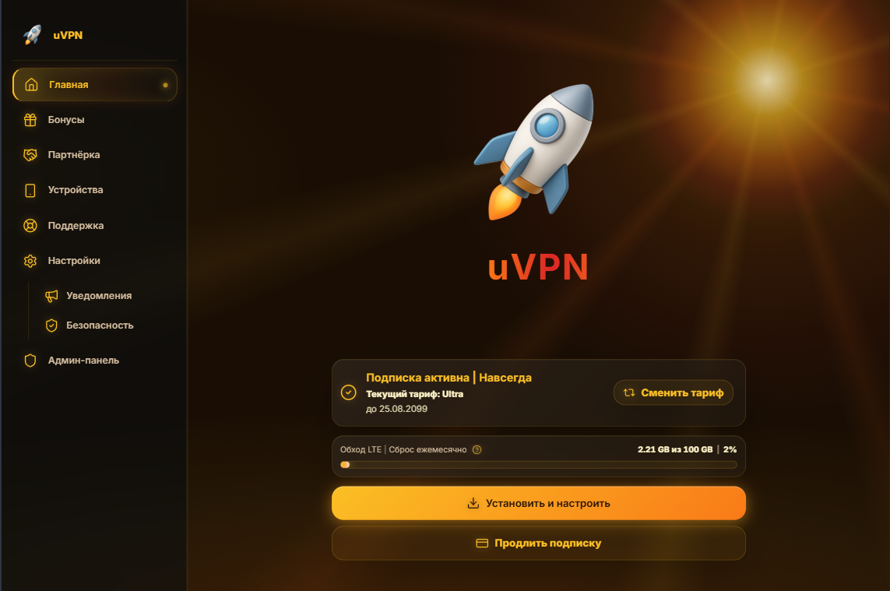

# 🌅 Solar — Восход солнца

Тёплая тема в духе золотого часа. Огромное солнце в правом верхнем углу, лучи медленно вращаются, тёплая пыль висит в воздухе, панели — матовое стекло с янтарным оттенком. Тема MiniShop с двумя вариантами — тёмным и светлым.

## 📸 Превью



## ✨ Особенности

### Фон

- **Огромное солнце** в правом верхнем углу — яркий диск + двойной ореол + широкое зарево над горизонтом. Мягко «дышит» — цикл 14 секунд.
- **Вращающиеся лучи** — `conic-gradient` из точки солнца, 12 лучей, чередующихся жёлтым и оранжевым. Медленно вращаются вокруг солнца за 3 минуты. Реализованы через большой квадрат `200vmax` с центром в точке солнца — при вращении лучи всегда сохраняют полную длину и не обрезаются.
- **Тёплая пыль** — 15 мелких точек тёплого оттенка, тайл 900×700. Лёгкое мерцание 11s.
- **Падающая искра** — золотая искра раз в 55 секунд прочерчивает диагональ с задержкой 12s.

### UI

- **Логотип** — переливающийся градиент жёлтый → оранжевый → красный. Анимация `background-position` 11s.
- **Aurora-линия по правому краю сайдбара** — вертикальный градиент через `background-image`, без `position: relative` (это критично: `position: relative` ломает мобильный drawer админки).
- **Активные пункты меню** — янтарная подсветка, левая полоса, пульсирующая точка справа.
- **Кнопки** — «золотые», со свечением и пробегающим бликом через `::before`.
- **Прогресс-бары** — как рассвет: жёлтый → оранжевый → красный + сканирующий блеск.
- **Фокус форм** — тёплое кольцо с внешним свечением.
- **Карточки** — тёплое стекло с янтарной обводкой и свечением при наведении.
- **Иконки Lucide** — янтарное свечение через `drop-shadow`. В золотых кнопках — тёмно-коричневый (`#2a1408`), не чёрный.
- **Скроллбар** — тёплый градиент на ползунке.

### Доступность и мобильные

- Все анимации отключаются при `prefers-reduced-motion: reduce`.
- На `≤ 1023px`: солнце компактнее и ближе к углу, лучи выключаются, искра убирается, blur панелей снижается, пульсации активных пунктов отключаются.

## 🎨 Токены

### Основные цвета

| Токен        | Тёмный вариант | Светлый вариант | Использование                                                   |
| ----------------- | --------------------------- | ----------------------------- | ---------------------------------------------------------------------------- |
| `accent`        | `#fbbf24`                 | `#ea580c`                   | Главный акцент, ссылки, активные элементы |
| `bg`            | `#1a0e04`                 | `#fef7ed`                   | Базовый фон                                                        |
| `panel`         | `#1e140a` α .70          | `#fff8eb` α .78            | Основные панели, карточки                              |
| `panel_2`       | `#281a0e` α .75          | `#fff0dc` α .85            | Вторичные поверхности, тосты, дропдауны    |
| `panel_3`       | `#180f08` α .60          | `#fffaf0` α .72            | Сайдбар                                                               |
| `blue`          | `#f97316`                 | `#f97316`                   | Оранжевый помощник                                          |
| `border`        | `#fbbf24` α .14          | `#d97706` α .18            | Обычные границы                                                |
| `border_strong` | `#fbbf24` α .30          | `#d97706` α .38            | Активные границы                                              |

### Текст и состояния

| Токен | Тёмный вариант | Светлый вариант | Использование              |
| ---------- | --------------------------- | ----------------------------- | --------------------------------------- |
| `text`   | `#fef3c7`                 | `#3b2412`                   | Основной текст             |
| `muted`  | `#d6bfa0`                 | `#7c5a3a`                   | Второстепенный текст |
| `dim`    | `#8a7154`                 | `#a88868`                   | Placeholder, подписи             |
| `danger` | `#ef4444`                 | `#dc2626`                   | Ошибки                            |

## 🎨 Палитра

| Цвет                          | HEX         | Где встречается                                                    |
| --------------------------------- | ----------- | -------------------------------------------------------------------------------- |
| Жёлтый (акцент)       | `#fbbf24` | Диск солнца, лучи, кнопки, активные элементы |
| Светло-жёлтый         | `#fcd34d` | Hover ссылок                                                               |
| Янтарный                  | `#ffecb3` | Падающая искра                                                      |
| Кремовый диск         | `#fff4c8` | Внутренний слой диска солнца                            |
| Оранжевый                | `#f97316` | Середина градиентов, лучи                                  |
| Красный                    | `#dc2626` | Конец градиента логотипа, кнопок, прогресса |
| Крем (текст)             | `#fef3c7` | Основной текст в тёмном варианте                     |
| Коричневый (текст) | `#3b2412` | Основной текст в светлом варианте                   |
| Тёмный фон               | `#1a0e04` | Фон тёмного варианта                                           |
| Светлый фон             | `#fef7ed` | Фон светлого варианта                                         |
| Тёмно-коричневый   | `#2a1408` | Иконки и текст внутри золотых кнопок              |
| Красный (danger)           | `#ef4444` | Ошибки                                                                     |

## 🎬 Градиенты

| Название                  | CSS                                                                                                                                                               | Где применяется                                        |
| --------------------------------- | ----------------------------------------------------------------------------------------------------------------------------------------------------------------- | -------------------------------------------------------------------- |
| Solar (логотип)            | `linear-gradient(270deg, #fbbf24, #f97316 35%, #dc2626 55%, #f97316 75%, #fbbf24)`                                                                              | Логотип, бренд                                           |
| Золотая кнопка       | `linear-gradient(135deg, #fbbf24, #f97316 55%, #dc2626)`                                                                                                        | `.btn-primary`, `.admin-btn-primary`                             |
| Рассвет (прогресс) | `linear-gradient(90deg, #fbbf24, #f97316 55%, #dc2626)`                                                                                                         | Заливка прогресс-баров                           |
| Линия сайдбара       | `linear-gradient(180deg, transparent, rgba(251,191,36,.40) 20%, rgba(249,115,22,.60) 50%, rgba(220,38,38,.35) 80%, transparent)`                                | `.app-sidebar`, `.admin-sidebar` через `background-image` |
| Активный пункт       | `linear-gradient(90deg, rgba(251,191,36,.18), rgba(249,115,22,.08) 60%, transparent)`                                                                           | `.app-nav-item.active`                                             |
| Солнечный диск       | `radial-gradient(circle 220px at 86% 14%, rgba(255,244,200,.85), rgba(251,191,36,.60) 22%, rgba(249,115,22,.35) 48%, rgba(220,38,38,.14) 68%, transparent 88%)` | `.app-shell::before`                                               |
| Лучи (conic)                  | `conic-gradient(from 0deg at 50% 50%, rgba(251,191,36,0), rgba(251,191,36,.075) 5deg, ...)`                                                                     | `.app-shell::after`                                                |
| Зарево горизонта   | `radial-gradient(ellipse 130% 45% at 50% 105%, rgba(249,115,22,.16), rgba(251,191,36,.06) 45%, transparent 80%)`                                                | `.app-shell::before`                                               |

## 🔤 Шрифты

| Роль  | Семейство | Fallback                                           | Пример                       |
| --------- | ------------------ | -------------------------------------------------- | ---------------------------------- |
| Sans (UI) | Inter              | -apple-system, BlinkMacSystemFont, Segoe UI, Arial | Основной текст        |
| Logo      | Inter              | Segoe UI, sans-serif                               | Логотип, заголовки |
| Mono      | JetBrains Mono     | ui-monospace, Menlo, Consolas                      | Код, цифры                 |

Шрифты подтягиваются MiniShop через токены `font_sans`, `font_logo`, `font_mono`. В CSS используется `var(--font-ui)`.

## 📁 Структура

```
themes/solar/
├── LICENSE
├── README.md
├── theme.json
├── theme-package.json
├── style.css
└── preview.png
```

## 🌗 Варианты

**Два варианта — `dark` и `light`.** Solar — единственная тема MiniShop, где светлый вариант смотрится органично: тёплый солнечный свет естественно ложится и на тёмный, и на светлый фон. У пользователя появится переключатель.

- **dark** — «ночное золото»: тёмно-коричневый фон `#1a0e04`, кремовый текст `#fef3c7`, янтарный акцент `#fbbf24`. Ассоциация: солнце уже село, но небо ещё горит.
- **light** — «тёплый день»: светло-кремовый фон `#fef7ed`, тёмно-коричневый текст `#3b2412`, оранжевый акцент `#ea580c`. Ассоциация: утреннее солнце, мягкий свет.

Панели, границы, тосты и дропдауны автоматически подстраиваются под выбранный вариант через токены `--panel`, `--panel-2`, `--panel-3`, `--border`, `--border-strong`, `--text`, `--muted`, `--dim`, `--accent`.

## ⚙️ Установка

Через админ-панель MiniShop → **Настройки → Темы → Установить из Git**:

```
URL:      https://github.com/austnv/minishop-themes
Ветка:    master
Подпапка: themes/solar
```

ZIP в репозитории не хранится — MiniShop собирает пакет сам из указанной подпапки.

После обновления репозитория тему можно переустановить одной кнопкой.

## 📝 Лицензия

MIT — см. [LICENSE](./LICENSE).
