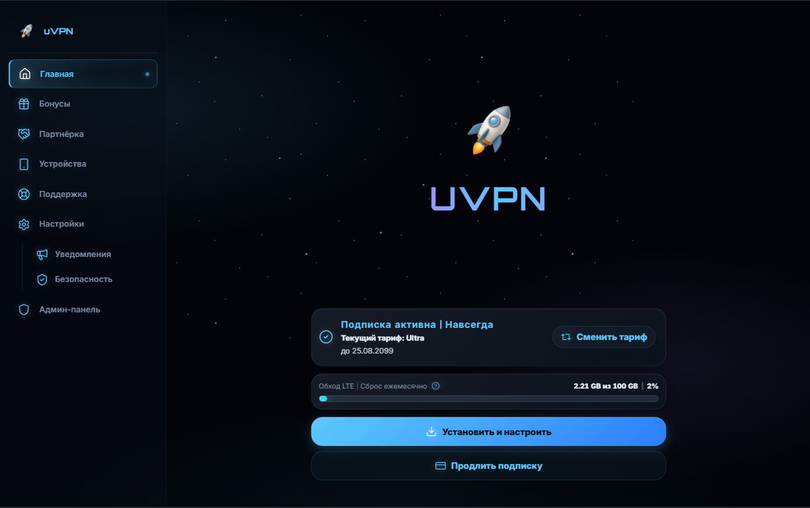

# 🌌 Universe

Космический скин для MiniShop. Тёмное пространство, мерцающие звёзды, туманности, стеклянные панели, тонкие светящиеся линии.

## 📸 Превью



## ✨ Особенности

- **Анимированный космический фон** — два слоя звёзд и три туманности, медленно дрейфуют по диагонали.
- **Кометы** — раз в 45–60 секунд через экран пролетает светящаяся точка.
- **Матовое стекло** — панели, карточки и модалки используют `backdrop-filter: blur()`.
- **Пульсирующие акценты** — активный пункт меню подсвечен слева, справа — мигающая точка.
- **Переливающийся логотип** — градиент плавно течёт от голубого к фиолетовому.
- **Топливные прогресс-бары** — с бегущим световым бликом по заливке.
- **Уважение к `prefers-reduced-motion`** — пользователи с ограничениями по анимации получат спокойную версию.
- **Оптимизация под мобильные** — тяжёлые эффекты отключаются, меню подсвечивается мягко.

## 🎨 Токены

### Основные цвета

| Токен | Значение | Плашка | Использование |
|-------|----------|:------:|---------------|
| `accent` | `#5cc8ff` |  | «Реактор» интерфейса — свечения, границы, кнопки |
| `bg` | `#02040a` |  | Вакуум — почти чёрный с холодным оттенком |
| `panel` | `#080e18` |  | Основная панель |
| `panel_2` | `#0d1521` |  | Вложенная панель |
| `panel_3` | `#141f2e` |  | Всплывающие элементы, тосты |
| `border` | `rgba(92, 200, 255, 0.14)` |  | Обычные границы |
| `border_strong` | `rgba(92, 200, 255, 0.32)` |  | Акцентные границы |

### Текст и состояния

| Токен | Значение | Плашка | Использование |
|-------|----------|:------:|---------------|
| `text` | `#eaf3fb` |  | Основной текст |
| `muted` | `#7d92ab` |  | Второстепенный текст |
| `dim` | `#465a73` |  | Приглушённый текст |
| `danger` | `#ff5c7c` |  | Ошибки и предупреждения |
| `blue` | `#5cc8ff` |  | Информационные сообщения |

## 🎨 Палитра

Все цвета, которые встречаются в теме — включая те, что используются только внутри CSS, но не объявлены как токены.

| Цвет | Hex | Плашка | Где встречается |
|------|-----|:------:|-----------------|
| Небесно-голубой | `#5cc8ff` |  | Основной акцент |
| Голубой неон | `#00e5ff` |  | Прогресс-бары |
| Фиолетовый | `#a78bfa` |  | Градиент логотипа |
| Глубокий синий | `#2b7fff` |  | Кнопки |
| Вакуум | `#02040a` |  | Фон |
| Глубокий космос | `#080e18` |  | Панели |
| Приглушённый красный | `#ff5c7c` |  | Ошибки |
| Стекло панелей | `rgba(8, 14, 24, 0.75)` |  | Карточки, модалки |
| Туманность голубая | `rgba(92, 200, 255, 0.10)` |  | Фоновая туманность |
| Туманность фиолетовая | `rgba(167, 139, 250, 0.09)` |  | Фоновая туманность |                                      |

## 🎬 Градиенты

| Название                 | CSS                                                                                       | Где применяется                                                                   |
| -------------------------------- | ----------------------------------------------------------------------------------------- | ----------------------------------------------------------------------------------------------- |
| Шиммер логотипа    | `linear-gradient(270deg, #5cc8ff, #a78bfa, #00e5ff, #a78bfa, #5cc8ff)`                  | Переливающийся текст логотипа и заголовков                |
| Реактор кнопки      | `linear-gradient(135deg, #5cc8ff, #2b7fff)`                                             | Основные кнопки действия                                                  |
| Топливная шкала    | `linear-gradient(90deg, #5cc8ff, #00e5ff)`                                              | Заливка прогресс-баров                                                      |
| Блик по прогрессу | `linear-gradient(90deg, transparent, rgba(255,255,255,0.55), transparent)`              | Анимированный пробегающий блик                                      |
| Проблеск кнопки    | `linear-gradient(120deg, transparent 30%, rgba(255,255,255,0.25) 50%, transparent 70%)` | Световая полоса, проходящая по кнопке при наведении |

## 🔤 Шрифты

| Роль                            | Семейство | Fallback                                               | Плашка стиля                                                                                             |
| ----------------------------------- | ------------------ | ------------------------------------------------------ | ------------------------------------------------------------------------------------------------------------------- |
| UI                                  | `Inter`          | `-apple-system, BlinkMacSystemFont, Segoe UI, Arial` | <span style="font-family:Inter,sans-serif;">Пример текста интерфейса</span>                   |
| Логотип / заголовки | `Orbitron`       | `Michroma, Inter`                                    | <span style="font-family:Orbitron,Michroma,sans-serif;letter-spacing:2px;text-transform:uppercase;">Universe</span> |
| Моноширинный            | `JetBrains Mono` | `ui-monospace, SFMono-Regular, Menlo, Consolas`      | <span style="font-family:'JetBrains Mono',monospace;">token: </span>                                                |

Шрифты не поставляются с темой — MiniShop подтягивает их по токенам `font_sans`, `font_logo`, `font_mono`.

## 📁 Структура

```
themes/universe/
├── LICENSE          # MIT (копия корневого)
├── README.md        # Этот файл
├── theme.json       # Конфиг MiniShop
├── style.css        # Все стили темы
└── preview.webp     # Превью 1280×800
```

## 🌗 Варианты

Тема объявляет **только** вариант `dark`. Переключатель light/dark у пользователя не появится — космос всегда космос.

## ⚙️ Установка

### Через Git

```
URL:      https://git.uvpn.app/austnv/minishop-themes
Ветка:    master
Подпапка: themes/universe
```

## 📝 Лицензия

MIT — см. [LICENSE](./LICENSE).
